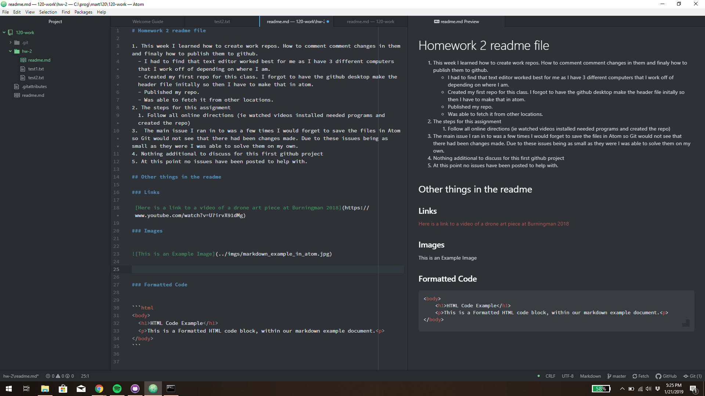

# Homework 2 readme file

1. This week I learned how to create work repos. How to comment changes in them and finally how to publish them to github.
	- I had to find that text editor worked best for me as I have 3 different computers that I work off of depending on where I am.
	- Created my first repo for this class. I forgot to have the github desktop make the header file initially so then I have to make that in atom.
	- Published my repo.
	- Was able to fetch it from other locations.
2. The steps for this assignment
	1. Follow all online directions (ie watched videos installed needed programs and created the repo)
3.  The main issue I had was I would forget to save the files in Atom so Git would not see that there had been changes made. Due to these issues being as small as they were I was able to solve them on my own.
4. Nothing additional to discuss for this first github project.
5. At this point no issues have been posted to help with.

## Other things in the readme

### Links

 [Here is a link to a video of a drone art piece at Burningman 2018 created by Studio Drift](https://www.youtube.com/watch?v=U7irvX91dMg) 

### Images





### Formatted Code


```html
<body>
	<h1>HTML Code Example</h1>
	<p>This is a Formatted HTML code block, within our markdown example document.<p>
</body>
```
